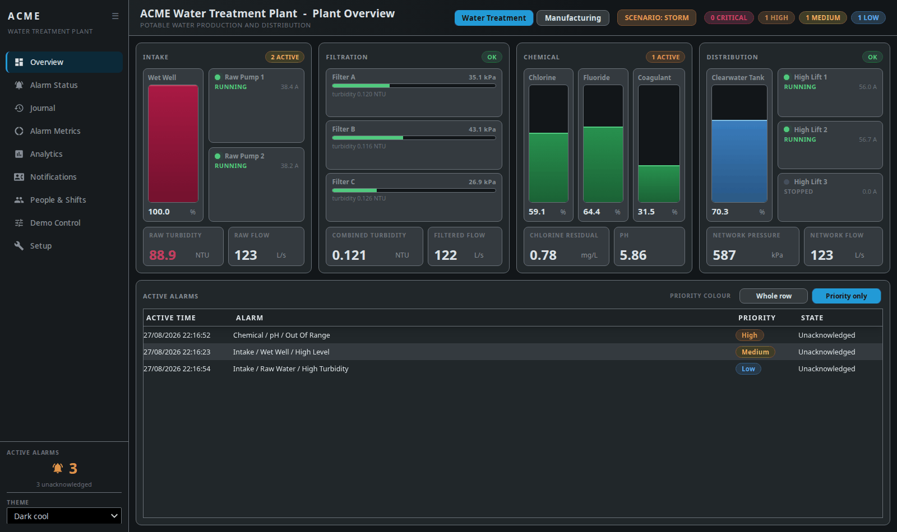
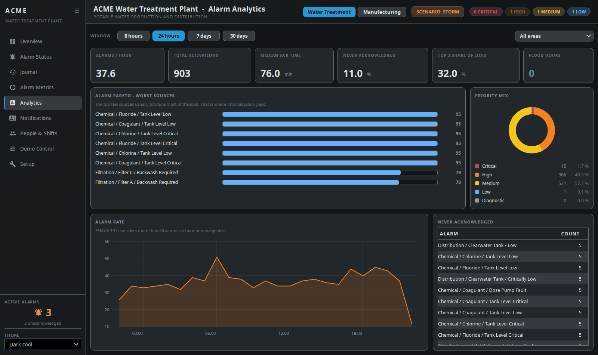
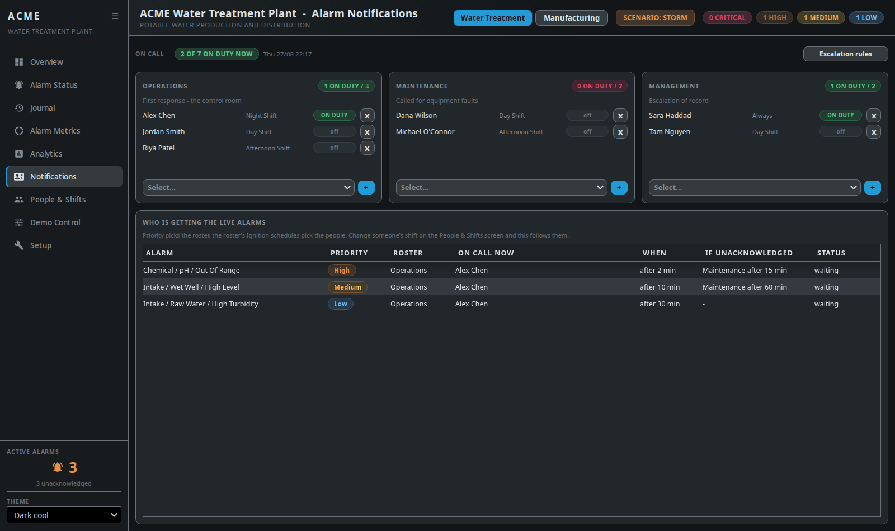
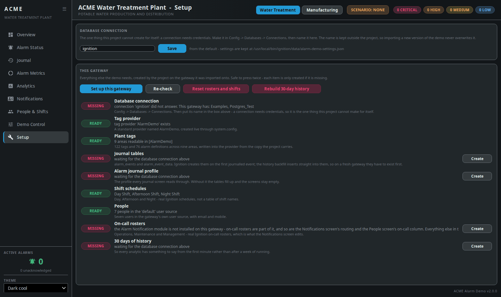
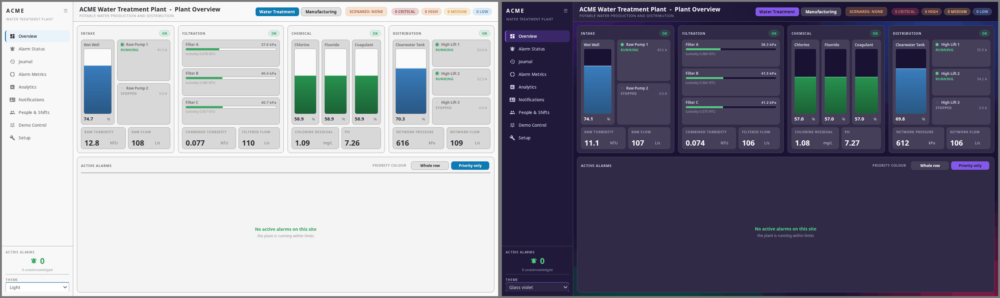

# ACME Alarm Demo

A self-contained Ignition 8.3 demonstration of **creating, visualising, routing
and analysing alarms**.

## Why this exists

Two simulated plants, 76 alarms, real on-call rosters and shift schedules, and
30 days of journal history, with no PLC, no OPC server and no external device.
A gateway timer script simulates both plants. Every alarm on screen has been
through the real Ignition alarm pipeline: evaluation, deadband, time delay,
priority, acknowledgement, journal, roster and schedule.

**[Download the project →](https://github.com/Gaskony-Ignition/ignition-alarm-demo/releases/latest)**

One zip. Import it, press one button on its Setup screen, and the demo is
running.

## What it looks like

### Overview — live plant mimic, scoped to the selected site



### Analytics — Pareto, alarm rate against EEMUA 191, priority mix



### Notifications — who is actually being called, right now



## What it does

| | |
| --- | --- |
| **Two switchable sites** | ACME Water Treatment Plant, and ACME Manufacturing — a beverage bottling line. Both run continuously, so the switch in the header is instant. |
| **122 tags / 76 alarms** | across 9 process areas, all five priorities, six alarm modes. |
| **12 demo scenarios** | storm, chlorine dose failure, pump trips, filter blinding, a chattering nuisance alarm, line jam, chiller failure, air loss, low CO₂, batch over-temperature. |
| **~10,000 rows of journal history** | 30 days for both sites, with diurnal peaks, quiet weekends, bad actors and realistic acknowledgement behaviour. |
| **Real gateway objects** | 7 users, 3 shift schedules, 3 on-call rosters — visible under Security → Users and Alarming → Rosters, not a table pretending to be them. |
| **9 Perspective screens** | mimic, alarm status, journal, per-area metrics, analytics, notification routing, people and shifts, demo control, setup. |
| **Every Ignition theme** | the six stock variants and any custom theme installed on the gateway, picked from the sidebar. |

Alarm Status and Journal use **Ignition's own stock components**, because the
point is to demonstrate what Ignition does.

## How to use it

### Install

You need Ignition **8.3.8+** with Perspective and a **SQL database connection** —
the analytics and journal history are SQL, not tag history. Shipped against
PostgreSQL. The Alarm Notification module is needed for the on-call rosters;
without it everything else still works and the Setup screen says so.

1. **Import the project.** Config → Platform → Projects → Import Project,
   choose `Alarm_Demo-<version>.zip` from the
   [latest release](https://github.com/Gaskony-Ignition/ignition-alarm-demo/releases/latest),
   and give it a name.

2. **Open its Setup screen and press "Set up this gateway".**

   

   That creates the tag provider, the 122 tags and their alarms, the alarm
   journal profile, the journal tables, the three shift schedules, the seven
   users, the three on-call rosters and 30 days of history — all of it, on the
   gateway, from the project. It takes about a minute and it is safe to press
   twice: each item is only created if it is missing.

That is the whole install. There is no package to unpack, no tag file to import
in the Designer, and no config scan to remember.

**If your database connection is not called `ignition`**, put its name in the
box at the top of the Setup screen and press Save first. That name is the one
thing the demo keeps outside the project — a connection needs credentials, so
it is the one piece of gateway state a project export has no business carrying.
Keeping it outside also means importing a newer version of the demo never
overwrites what the gateway is pointed at.

Every item is checked independently rather than stopping at the first failure.
"The connection is fine but the tables are missing" and "the connection is
wrong" need different actions and look identical if you only ever see the first
error — so each row says what it found, and each row that can be fixed has its
own **Create** button.

The same checks are available headlessly, which is the fastest way to look at a
gateway you cannot open a browser onto:

```
/system/webdev/AlarmDemo/admin?cmd=check
                            ?cmd=setup
                            ?cmd=fix&name=tags
                            ?cmd=db&name=Postgres_Test
```

The **build number** is at the bottom of the Setup and Demo Control screens, and
at `?cmd=version`. Worth knowing after an upgrade: an import that merges rather
than overwrites can leave old resources in place, and this is how you tell
rather than guess. Hard-refresh the browser (`Ctrl+Shift+R`) after upgrading —
the stylesheet is cached.

### Themes

The demo has no colours of its own. Every surface, border, text and accent
colour resolves to one of Ignition's own Perspective theme variables, so it
follows whichever theme the session is set to — the six stock variants, and any
custom theme installed on the gateway. Pick one from the sidebar; the choice
holds for the session.



The project's own default is **dark-cool**, the stock theme closest to the
palette the demo was designed in.

The one exception is the priority scale. Critical, High, Medium, Low and
Diagnostic keep their own colours on every theme, because their meanings are
fixed by convention and a customer has to read the same red as Critical
wherever they see it. What they take from the theme is contrast: each is mixed
toward the theme's own ink, so the scale darkens on a light theme and lightens
on a dark one.

### Running it

Open **Overview** and drive it from **Demo Control**:

- **Chlorine dose pump failure** — residual decays over about a minute and trips
  a Critical compliance alarm. A public-health limit, not a nuisance.
- **Case packer jam** — switch to Manufacturing. The jam blocks everything
  upstream, the line stops, and OEE falls while you watch.
- **Storm** — a cascade across three areas, then open **Analytics** and look at
  the alarm rate against the EEMUA 191 flood line.
- **Chattering nuisance alarm** — then the Pareto shows one source producing
  roughly a fifth of the whole alarm load. That is the alarm-rationalisation
  argument in one chart.
- **People & Shifts → Notifications** — move someone to a different shift and
  watch the "on call now" column follow them.

Scenarios bias the *simulation*, never the alarm state directly, so what you
demonstrate is what a real plant would produce. **Reset plant** returns
everything to normal.

The screens are built for a desktop or a laptop and each fits its window without
scrolling from 1280×620 up. There is deliberately no phone layout — the mimic
and the wider alarm tables need the width.

---

## More

- **[Reference](docs/REFERENCE.md)** — every screen, the headless control
  endpoint, and the things worth knowing before you point it at a shared
  journal.
- **[Developing](docs/DEVELOPING.md)** — the project is generated from Python;
  build, deploy and the findings behind the way it is put together.

## Licence

[MIT](LICENSE).
