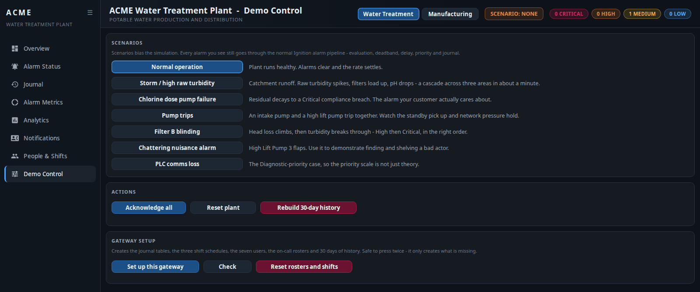

# ACME Alarm Demo

A self-contained Ignition 8.3 demonstration of **creating, visualising, routing
and analysing alarms** — two simulated plants, 76 alarms, real on-call rosters
and shift schedules, and 30 days of journal history, with no PLC, no OPC server
and no external device.

A gateway timer script simulates both plants. Every alarm on screen has been
through the real Ignition alarm pipeline: evaluation, deadband, time delay,
priority, acknowledgement, journal, roster and schedule.

**[Download the Exchange package →](https://github.com/Gaskony-Ignition/ignition-alarm-demo/releases/latest)**

---

### Overview — live plant mimic, scoped to the selected site

### Analytics — Pareto, alarm rate against EEMUA 191, priority mix

### Notifications — who is actually being called, right now

---

## What is in it

| | |
| --- | --- |
| **Two switchable sites** | ACME Water Treatment Plant, and ACME Manufacturing — a beverage bottling line. Both run continuously, so the switch in the header is instant. |
| **120 tags / 76 alarms** | across 9 process areas, all five priorities, six alarm modes. |
| **12 demo scenarios** | storm, chlorine dose failure, pump trips, filter blinding, a chattering nuisance alarm, line jam, chiller failure, air loss, low CO₂, batch over-temperature. |
| **~10,000 rows of journal history** | 30 days for both sites, with diurnal peaks, quiet weekends, bad actors and realistic acknowledgement behaviour. |
| **Real gateway objects** | 7 users, 3 shift schedules, 3 on-call rosters — visible under Security → Users and Alarming → Rosters, not a table pretending to be them. |
| **8 Perspective screens** | mimic, alarm status, journal, per-area metrics, analytics, notification routing, people and shifts, demo control. |

Alarm Status and Journal use **Ignition's own stock components**, because the
point is to demonstrate what Ignition does.

## Install

Download `acme_alarm_demo.1.0.2.zip` from the
[latest release](https://github.com/Gaskony-Ignition/ignition-alarm-demo/releases/latest)
and unzip it.

You need Ignition **8.3.8+** with Perspective, Alarm Notification, and a **SQL
database connection** — the analytics and journal history are SQL, not tag
history. Shipped against PostgreSQL.

Two things a project import cannot bring with it, because they are not project
resources. Copy each into `data/config/resources/core/ignition/` and run
**Platform → Overview → Scan File System**, or create them by hand:

1. **A tag provider named `AlarmDemo`** — `Gateway/tag-provider/AlarmDemo/`.
   The name matters: an alarm's *Area* is the first segment of its tag path, so
   the areas have to sit at the root of their own provider.
2. **An alarm journal profile named `AlarmDemo`** — `Gateway/alarm-journal/AlarmDemo/`.
   A Datasource profile against your database, writing the standard
   `alarm_events` / `alarm_event_data` tables.

Then:

3. **Import the project** — `Projects/AlarmDemo.zip`, from the gateway web page
   or the Designer.
4. **Import the tags** — Designer → Tag Browser → Import →
   `Tags/AlarmDemo-tags.json`, targeting the `AlarmDemo` provider.
5. **If your database connection is not named `ignition`**, change the `DB`
   constant at the top of the `AlarmDemo.alarms` script. It is defined once and
   every other module reads it from there.
6. **Press "Set up this gateway"** on the Demo Control screen. That creates the
   journal tables, the three shift schedules, the seven users, the three on-call
   rosters and 30 days of history. It is safe to run twice — it only creates
   what is missing.

   

   *Reset rosters and shifts*, beside it, is the destructive one — it puts the
   people back to how they shipped.

**Check**, on that same card — or `AlarmDemo.setup.check()`, or
`/system/webdev/AlarmDemo/admin?cmd=check` — reports on the tag provider, the
journal profile, the journal tables, the rosters, the schedules and the users
separately. A fresh install goes wrong in several ways that all look like the
same blank screen; this is what tells them apart.

## Running it

Open **Overview** and drive it from **Demo Control**:

- **Chlorine dose pump failure** — residual decays over about a minute and trips
  a Critical compliance alarm. A public-health limit, not a nuisance.
- **Case packer jam** — switch to Manufacturing. The jam blocks everything
  upstream, the line stops, and OEE falls while you watch.
- **Storm** — a cascade across three areas, then open **Analytics** and look at
  the alarm rate against the EEMUA 191 flood line.
- **Chattering nuisance alarm** — then the Pareto shows one source producing
  roughly a fifth of the whole alarm load. That is the alarm-rationalisation
  argument in one chart.
- **People & Shifts → Notifications** — move someone to a different shift and
  watch the "on call now" column follow them.

Scenarios bias the *simulation*, never the alarm state directly, so what you
demonstrate is what a real plant would produce. **Reset plant** returns
everything to normal.

The screens are built for a desktop or a laptop and each fits its window without
scrolling from 1280×620 up. There is deliberately no phone layout — the mimic
and the wider alarm tables need the width.

## More

- **[Full package documentation](exchange/README.md)** — every screen, the
  headless control endpoint, and the things worth knowing before you point it at
  a shared journal.
- **[Developing](docs/DEVELOPING.md)** — the project is generated from Python;
  build, deploy and the findings behind the way it is put together.

## Licence

[MIT](LICENSE).
